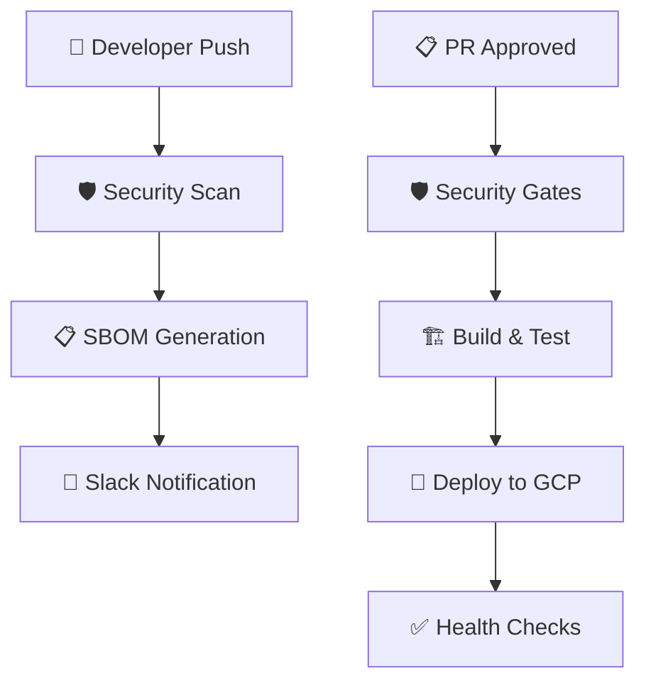

# 🛡️ DevSecOps Portfolio

[](https://github.com/msrj-xyz/devsecops/actions/workflows/security-scan.yml)
[](https://github.com/msrj-xyz/devsecops/actions/workflows/deploy.yml)

**Enterprise-grade DevSecOps Portfolio** demonstrating modern security-first development practices, automated CI/CD pipelines, and cloud-native infrastructure implementations.

---

## 🚀 Quick Start

**New to this project?** Start here:

1. 📚 **[Complete Documentation Hub](./docs/README.md)** - Comprehensive guides and references
2. 🌟 **[Google Cloud Setup Guide](./docs/GCP_COMPLETE_SETUP_GUIDE.md)** - Step-by-step deployment
3. 🔄 **[Simplified Workflows](./docs/WORKFLOW_GUIDE.md)** - Understanding the DevSecOps pipeline

---

## 🎯 What's Inside

**Simplified DevSecOps Pipeline:**

1. **🛡️ Security Scan & SBOM** - Automated security scanning on every push
2. **🚀 Deploy to Google Cloud** - PR-approved deployment with security gates

**Sample Applications:**
- **React Frontend** - Modern SPA with security hardening
- **Node.js API** - RESTful backend with comprehensive security
- **Docker Containers** - Multi-stage builds with vulnerability scanning

**Cloud Infrastructure:**
- **Google Kubernetes Engine** - Production-ready clusters
- **Terraform IaC** - Infrastructure as code with compliance
- **Security Monitoring** - Real-time threat detection

> 📖 **[View Complete Documentation](./docs/README.md)** for detailed guides, best practices, and implementation details.

## 🏗️ Architecture Overview



**Current Technology Stack:**
- **Frontend**: React.js with security hardening
- **Backend**: Node.js Express API
- **Infrastructure**: Google Cloud Platform (GKE)
- **Security**: 8+ integrated security tools
- **Monitoring**: Comprehensive observability stack

> 🔧 **[View Full Architecture Details](./docs/README.md#architecture-documentation)** in the documentation hub.

## 📁 Project Structure

```
devsecops/
├── projects/           # Sample applications (React + Node.js)
├── infrastructure/     # Terraform IaC for Google Cloud
├── k8s/                # Kubernetes deployment manifests
├── .github/workflows/  # DevSecOps CI/CD pipelines
└── docs/               # 📚 Complete documentation hub
```

## 📅 Getting Started

**Step-by-step setup process:**

1. **Prerequisites**: GitHub account, Google Cloud Platform access
2. **Repository Setup**: Fork and configure repository secrets
3. **Cloud Infrastructure**: Deploy using Terraform
4. **Pipeline Testing**: Validate workflows with sample applications

> 🚀 **[Get Started Now](./docs/GCP_COMPLETE_SETUP_GUIDE.md)** - Complete setup guide with screenshots and troubleshooting.

## 📚 Documentation Hub

**All detailed guides are centralized in the [docs folder](./docs/README.md):**

- **🎆 Quick Setup**: [GCP Complete Setup Guide](./docs/GCP_COMPLETE_SETUP_GUIDE.md)
- **🔄 Workflows**: [Simplified Workflow Guide](./docs/WORKFLOW_GUIDE.md) 
- **🛡️ Security**: [Best Practices](./docs/BEST_PRACTICES.md) & [Security Policy](./docs/SECURITY_POLICY.md)
- **🤝 Contributing**: [Contribution Guidelines](./docs/CONTRIBUTING.md)
- **📊 Analysis**: [Implementation Analysis](./docs/WORKFLOW_ANALYSIS.md)

## ✨ Key Features

**Enterprise DevSecOps Pipeline:**
- 🛡️ **Automated Security Scanning** - 8+ integrated security tools
- 📊 **SBOM Generation** - Complete software bill of materials
- 🔔 **Real-time Notifications** - Slack integration for all pipeline events
- 🚀 **Automated Deployment** - PR-approved deployments with rollback capability
- 🌍 **Multi-environment** - Development, staging, and production ready

---

## 🤝 Contributing

We welcome contributions! Please see our [Contributing Guide](./docs/CONTRIBUTING.md) for details.

## 📜 License

This project is licensed under the MIT License - see the [LICENSE](LICENSE) file for details.

---

**📚 [Explore Complete Documentation →](./docs/README.md)**