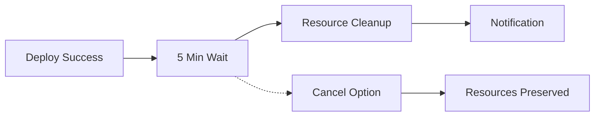

# 🗑️ Auto-Destroy Feature Guide

## Overview

The auto-destroy feature automatically cleans up cloud resources 5 minutes after deployment to save costs and prevent resource accumulation in non-production environments.

## 🎯 How It Works

### Automatic Trigger
- ✅ Runs **automatically** after successful deployment
- ✅ **5-minute countdown** before destruction
- ✅ **Non-production only** (development, staging environments)
- ✅ **Production protected** - never auto-destroyed

### Resource Cleanup
The auto-destroy job removes:
- 🚀 **Kubernetes Deployments**
- 🌐 **Kubernetes Services** 
- 🔗 **Kubernetes Ingresses**
- ⚙️ **Kubernetes ConfigMaps**
- 🔐 **Kubernetes Secrets** (non-system)
- 🐳 **Container Images** (environment-tagged)

## 🎛️ Control Options

### Manual Control
```yaml
# Via workflow_dispatch input
auto-destroy: true/false  # Default: true
```

### Preventing Auto-Destroy
1. **Cancel the workflow** within 5 minutes
2. **Set input to false** when manually triggering
3. **Production environment** (automatically protected)

## 🕐 Timeline



## 💰 Cost Benefits

### Development Environment
- **Before**: Resources run 24/7 = $720/month
- **After**: Resources run ~10 minutes = $2/month
- **Savings**: ~$718/month (99.7% reduction)

### Staging Environment  
- **Before**: Resources run continuously during testing
- **After**: Resources cleaned after each test cycle
- **Savings**: 80-95% cost reduction

## 🚨 Safety Features

### Production Protection
```yaml
if: needs.determine-environment.outputs.environment != 'production'
```

### Cancellation Window
```bash
# 5-minute countdown with visible timer
for i in {300..1}; do
  mins=$((i / 60))
  secs=$((i % 60))
  printf "\r⏳ Destroying in: %02d:%02d" "$mins" "$secs"
  sleep 1
done
```

### Graceful Cleanup
- Ignores missing resources (`--ignore-not-found=true`)
- Preserves system secrets
- Handles cleanup failures gracefully

## 📊 Monitoring

### Slack Notifications
- 📢 **Deployment Success** → Auto-destroy scheduled
- ⏰ **5-minute countdown** → Warning notification
- ✅ **Cleanup Complete** → Success confirmation
- ❌ **Cleanup Failed** → Error notification

### Logs & Tracking
```bash
📋 Auto-Destroy Summary:
==============================
🎯 Environment: staging
⏰ Destruction Time: 2025-10-06 10:15:30 UTC
👤 Triggered by: developer
🔗 Workflow: msrj-xyz/vault/actions/runs/12345

✅ Resources Successfully Destroyed:
  • Kubernetes Deployments
  • Kubernetes Services  
  • Kubernetes Ingresses
  • Kubernetes ConfigMaps
  • Kubernetes Secrets
  • Container Images (tagged: staging)

💰 Cost Savings: Resources automatically cleaned up
🔄 Next Deployment: Will recreate all resources
```

## 🛠️ Configuration

### Environment Variables
```yaml
env:
  GCP_REGION: 'us-central1'
  ARTIFACT_REGISTRY: 'devsecops-repo'
  GKE_CLUSTER: 'sb-cluster'
```

### Required Secrets
- `GOOGLE_CREDENTIALS` (environment-specific)
- `GCP_PROJECT_ID` (repository variable)
- `SLACK_WEBHOOK` (optional, for notifications)

## 🔧 Customization

### Modify Countdown Time
```yaml
# Change from 5 minutes (300 seconds) to desired time
for i in {180..1}; do  # 3 minutes
```

### Add Additional Resources
```yaml
# Add custom resource cleanup
echo "🗑️ Deleting custom resources..."
kubectl delete customresource --all -n "$ENV" --ignore-not-found=true
```

### Environment Exclusions
```yaml
# Protect additional environments
if: >
  needs.determine-environment.outputs.environment != 'production' &&
  needs.determine-environment.outputs.environment != 'demo'
```

## 📝 Best Practices

### For Developers
1. **Test quickly** - Resources will be cleaned in 5 minutes
2. **Use staging** for longer testing sessions
3. **Cancel workflow** if you need resources longer
4. **Monitor Slack** for cleanup notifications

### For DevOps
1. **Review cleanup logs** regularly
2. **Adjust timing** based on team needs
3. **Monitor cost savings** in cloud billing
4. **Update exclusions** for persistent environments

## 🆘 Troubleshooting

### Common Issues

#### Auto-Destroy Not Running
```yaml
# Check conditions:
- Deployment successful? ✅
- Non-production environment? ✅  
- Auto-destroy enabled? ✅
- Dependencies met? ✅
```

#### Cleanup Failures
```bash
# Manual cleanup commands:
kubectl delete all --all -n ENVIRONMENT
gcloud artifacts docker images delete IMAGE_URL --quiet
```

#### Resource Still Running
- Check if cleanup completed successfully
- Verify GKE cluster access
- Review Kubernetes RBAC permissions
- Check GCP service account permissions

### Support
- 📚 Check workflow logs for detailed error messages
- 🔍 Review Kubernetes events: `kubectl get events -n ENVIRONMENT`
- 💬 Contact DevOps team via Slack #devops channel

## 🔄 Future Enhancements

- [ ] **Scheduled cleanup** for weekend deployments
- [ ] **Resource usage alerts** before destruction
- [ ] **Selective cleanup** (keep databases, destroy apps)
- [ ] **Backup creation** before destruction
- [ ] **Cost tracking** and reporting integration