# 🌍 Multi-Environment Configuration Guide

## Environment Strategy Overview

This DevSecOps portfolio supports 3 environments with different deployment strategies:

### 🔵 Development Environment
- **Branch Trigger**: `development`, `dev/*`, `feature/*`
- **Auto Deploy**: ✅ Automatic deployment on push
- **Approval Required**: ❌ No manual approval
- **Resources**: Minimal (1 node, basic monitoring)
- **Purpose**: Feature development and testing

### 🟡 Staging Environment  
- **Branch Trigger**: `staging`, `release/*`
- **Auto Deploy**: ✅ Automatic deployment on push
- **Approval Required**: ⚠️ Optional reviewer approval
- **Resources**: Production-like (3 nodes, full monitoring)
- **Purpose**: Pre-production testing and validation

### 🔴 Production Environment
- **Branch Trigger**: `main`, `master`
- **Auto Deploy**: ❌ Manual approval required
- **Approval Required**: ✅ Required reviewer approval
- **Resources**: Full production (auto-scaling, HA, monitoring)
- **Purpose**: Live production workloads

---

## GitHub Environment Configuration

### Step 1: Create GitHub Environments

Go to: `https://github.com/msrj-xyz/devsecops/settings/environments`

#### Create Development Environment
1. Click "New environment"
2. Name: `development`
3. **Deployment protection rules**: None
4. **Environment secrets**: Add development-specific secrets

#### Create Staging Environment
1. Click "New environment"  
2. Name: `staging`
3. **Deployment protection rules**: 
   - ✅ Required reviewers (optional, add team members)
   - ⏱️ Wait timer: 5 minutes (optional)
4. **Environment secrets**: Add staging-specific secrets

#### Create Production Environment
1. Click "New environment"
2. Name: `production` 
3. **Deployment protection rules**:
   - ✅ Required reviewers (MANDATORY - add team leads/managers)
   - ⏱️ Wait timer: 30 minutes
   - 🌿 Selected branches only: `main`, `master`
4. **Environment secrets**: Add production-specific secrets

---

## Environment-Specific Secrets

### For Each Environment, Add These Secrets:

#### Development Environment Secrets
```
GOOGLE_CREDENTIALS_DEV      = [Service account JSON for dev]
GCP_PROJECT_ID_DEV         = devsecops-portfolio-dev
GCP_SA_EMAIL_DEV           = github-actions-dev-sa@project.iam.gserviceaccount.com
DATABASE_URL_DEV           = postgresql://dev-db-connection
API_BASE_URL_DEV           = https://dev-api.devsecops-demo.com
```

#### Staging Environment Secrets  
```
GOOGLE_CREDENTIALS_STAGING  = [Service account JSON for staging]
GCP_PROJECT_ID_STAGING     = devsecops-portfolio-staging
GCP_SA_EMAIL_STAGING       = github-actions-staging-sa@project.iam.gserviceaccount.com
DATABASE_URL_STAGING       = postgresql://staging-db-connection
API_BASE_URL_STAGING       = https://staging-api.devsecops-demo.com
```

#### Production Environment Secrets
```
GOOGLE_CREDENTIALS_PROD     = [Service account JSON for production]
GCP_PROJECT_ID_PROD        = devsecops-portfolio-prod  
GCP_SA_EMAIL_PROD          = github-actions-prod-sa@project.iam.gserviceaccount.com
DATABASE_URL_PROD          = postgresql://prod-db-connection
API_BASE_URL_PROD          = https://api.devsecops-demo.com
```

---

## Deployment Workflow Strategy

### Branch → Environment Mapping


### Deployment Process Flow

```mermaid
graph TD
    A[Code Push] --> B{Which Branch?}
    B -->|feature/dev| C[Deploy to Development]
    B -->|staging/release| D[Deploy to Staging] 
    B -->|main/master| E[Manual Approval Required]
    
    C --> F[Run Tests]
    D --> G[Run Integration Tests]
    E --> H[Production Deployment]
    
    F --> I[Development Validated ✅]
    G --> J[Staging Validated ✅]
    H --> K[Production Live ✅]
    
    J --> L[Promote to Production?]
    L -->|Yes| E
    L -->|No| M[Fix Issues]
    M --> D
```



---

## Security Configuration Per Environment

### Development Environment
- **Security Level**: Basic
- **Scanning**: SAST only
- **Secrets**: Development keys (limited permissions)
- **Monitoring**: Basic logging
- **Data**: Synthetic/test data only

### Staging Environment  
- **Security Level**: Production-like
- **Scanning**: Full security suite (SAST, DAST, SCA)
- **Secrets**: Staging keys (production-like permissions)
- **Monitoring**: Full monitoring stack
- **Data**: Anonymized production data

### Production Environment
- **Security Level**: Maximum
- **Scanning**: Complete security validation
- **Secrets**: Production keys (full permissions)
- **Monitoring**: Enterprise monitoring + alerting
- **Data**: Live production data

---

## Cost Optimization by Environment

### Development
- **Compute**: 1 node, e2-small instances
- **Storage**: Standard persistent disk
- **Network**: Basic networking
- **Estimated Cost**: ~$30/month

### Staging
- **Compute**: 2 nodes, e2-standard-2 instances  
- **Storage**: SSD persistent disk
- **Network**: Premium networking
- **Estimated Cost**: ~$120/month

### Production
- **Compute**: 3+ nodes, e2-standard-4 instances (auto-scaling)
- **Storage**: High-performance SSD
- **Network**: Premium + load balancing
- **Estimated Cost**: ~$300+/month

---

## Environment Promotion Strategy

### Automatic Promotions
1. **feature/* → development**: Automatic on push
2. **development → staging**: Manual via PR to staging branch
3. **staging → production**: Manual via PR to main branch

### Manual Promotion Process
1. Create PR from development to staging
2. Run staging validation tests
3. Manual approval from team lead
4. Create PR from staging to main  
5. Production deployment approval from manager
6. Blue-green deployment to production

---

## Monitoring & Observability

### Per-Environment Monitoring

#### Development
- Basic application logs
- Error tracking
- Performance monitoring (basic)

#### Staging
- Comprehensive logging
- APM (Application Performance Monitoring)
- Security monitoring
- Load testing results

#### Production  
- Enterprise monitoring stack
- Real-time alerting
- SLA/SLO tracking
- Business metrics
- Security incident response

---

## Rollback Strategy

### Development
- **Method**: Git revert + redeploy
- **Time**: < 5 minutes
- **Impact**: Development team only

### Staging
- **Method**: Blue-green rollback
- **Time**: < 15 minutes  
- **Impact**: QA team + stakeholders

### Production
- **Method**: Automated blue-green rollback
- **Time**: < 30 seconds
- **Impact**: End users (minimize downtime)
- **Process**: Automatic health check failure triggers rollback

---

## Next Steps

1. ✅ Create 3 GitHub environments
2. ✅ Add environment-specific secrets
3. ✅ Configure deployment protection rules
4. ✅ Update GitHub Actions workflows
5. ✅ Test deployment to each environment
6. ✅ Setup monitoring per environment
7. ✅ Document promotion procedures