# 🚀 Simplified DevSecOps Workflow Guide

## 📋 Overview

Sistem workflow DevSecOps yang disederhanakan dengan 2 workflow utama:

1. **🛡️ Security Scan & SBOM** - Berjalan pada setiap push
2. **🚀 Deploy to Google Cloud** - Berjalan ketika PR approved ke staging/production

## 🔄 Workflow Architecture

```mermaid
graph TD
    A[📝 Push to any branch] --> B[🛡️ Security Scan & SBOM]
    B --> C[📋 Generate Reports]
    C --> D[🔔 Slack Notification]
    
    E[📋 PR to staging/main] --> F{PR Approved & Merged?}
    F --> G[🛡️ Security Gate Check]
    G --> H{Security Gate Passed?}
    H --> I[🏗️ Build & Push Images]
    I --> J[🚀 Deploy to GCP]
    J --> K[🔔 Deployment Notification]
    
    H --> L[❌ Block Deployment]
```



## 🛡️ Workflow 1: Security Scan & SBOM Generation

### Triggers
- **Push** ke branch: `main`, `develop`, `staging`, `feature/*`
- **Pull Request** ke: `main`, `develop`, `staging`

### Security Tools Included
| Tool | Purpose | Output |
|------|---------|--------|
| TruffleHog | Secret detection | JSON report |
| GitLeaks | Secret scanning | JSON report |
| CodeQL | SAST analysis | SARIF file |
| Semgrep | Security rules | SARIF file |
| Snyk | Dependency scanning | JSON report |
| OWASP Dep Check | Vulnerability analysis | Multiple formats |
| Trivy | Container security | JSON report |
| Checkov | Infrastructure security | JSON report |

### SBOM Generation
- **CycloneDX format** - Industry standard
- **Multiple outputs**: JSON, XML
- **Coverage**: Node.js, Python, Universal project
- **Human-readable summary** included

### Outputs & Artifacts
- 📄 **Security reports** (downloadable for 90 days)
- 📋 **SBOM files** (downloadable for 90 days)
- 💬 **PR comments** with scan results
- 🔔 **Slack notifications** with summary

## 🚀 Workflow 2: Deploy to Google Cloud

### Triggers
- **PR closed** (merged) to `staging` or `main` branch
- **Manual dispatch** with environment selection

### Environment Mapping
| Branch | Environment | Security Gate | Resources |
|--------|-------------|---------------|-----------|
| `staging` | staging | Optional | 2 replicas, 500m CPU |
| `main` | production | **Required** | 3 replicas, 1000m CPU |

### Security Gate
- **Production deployments** require security scan to pass
- **Staging deployments** can proceed without security gate
- **Manual override** available via `force-deploy` parameter

### Deployment Process
1. **🎯 Environment determination**
2. **🛡️ Security gate check** (production only)
3. **🏗️ Build & push container images**
4. **🚀 Deploy to GKE cluster**
5. **🧪 Post-deployment health check**
6. **🔔 Slack notification**

## ⚙️ Required Setup

### GitHub Secrets
```bash
# Google Cloud Platform
GOOGLE_CREDENTIALS     # Service account JSON key
GCP_PROJECT_ID        # Your GCP project ID

# Security Tools (Optional)
SNYK_TOKEN           # Snyk API token
SEMGREP_TOKEN        # Semgrep API token

# Notifications (Optional)
SLACK_WEBHOOK        # Slack webhook URL
```

### Google Cloud Resources
- **GKE Cluster**: `devsecops-cluster` in `us-central1`
- **Artifact Registry**: `devsecops-repo`
- **Service Account**: With required permissions
- **Namespaces**: `staging`, `production`

## 📊 Usage Examples

### Example 1: Feature Development
```bash
# 1. Create feature branch
git checkout -b feature/new-feature

# 2. Make changes and push
git add .
git commit -m "Add new feature"
git push origin feature/new-feature

# ✅ Security scan runs automatically
# 📄 Reports available for download
# 🔔 Slack notification sent
```

### Example 2: Deploy to Staging
```bash
# 1. Create PR to staging
gh pr create --base staging --title "Deploy to staging"

# 2. Get PR approved and merge
gh pr merge --merge

# ✅ Deployment runs automatically
# 🛡️ Security gate optional
# 🚀 Deploy to staging environment
# 🔔 Slack notification with URL
```

### Example 3: Production Deployment
```bash
# 1. Create PR to main
gh pr create --base main --title "Production release v1.2.0"

# 2. Get PR approved and merge
gh pr merge --merge

# ✅ Security gate check required
# 🛡️ Must pass security scan
# 🚀 Deploy to production environment
# 🔔 Slack notification with URL
```

### Example 4: Manual Deployment
```bash
# Use GitHub Actions UI:
# 1. Go to Actions tab
# 2. Select "Deploy to Google Cloud"
# 3. Choose environment: staging/production
# 4. Set force-deploy: true/false
# 5. Run workflow
```

## 🔍 Monitoring & Reports

### Security Reports
- **📊 Summary dashboard** with vulnerability counts
- **📄 Detailed findings** per security tool
- **📋 SBOM files** for compliance
- **🔗 Download links** for all artifacts

### Deployment Status
- **🌐 Application URLs** after successful deployment
- **📊 Resource utilization** monitoring
- **🧪 Health check results**
- **📋 Deployment history** tracking

## 🛠️ Customization

### Adding New Security Tools
Edit `.github/workflows/security-scan.yml`:
```yaml
- name: 🔍 New Security Tool
  run: |
    # Install and run your security tool
    new-security-tool --output results.json
```

### Environment-Specific Configurations
Update Kubernetes manifests in `k8s/[environment]/`:
```yaml
# k8s/staging/deployment.yaml
spec:
  replicas: 2  # Staging configuration
  
# k8s/production/deployment.yaml  
spec:
  replicas: 3  # Production configuration
```

### Custom Slack Notifications
Modify notification steps in both workflows:
```yaml
- name: 🔔 Custom Slack Notification
  run: |
    # Your custom notification logic
```

## 🚨 Troubleshooting

### Security Scan Issues
```bash
# Check security scan logs
gh run list --workflow="security-scan.yml"
gh run view [run-id] --log

# Common issues:
# 1. Missing security tool tokens
# 2. Network connectivity issues
# 3. Large repository timeouts
```

### Deployment Issues
```bash
# Check deployment logs
gh run list --workflow="deploy.yml"
gh run view [run-id] --log

# Common issues:
# 1. Invalid GCP credentials
# 2. Insufficient permissions
# 3. Kubernetes resource limits
# 4. Image build failures
```

### Security Gate Failures
```bash
# Override security gate for emergency deployments
# Use manual dispatch with force-deploy: true

# Or fix security issues and re-run scan
git add .
git commit -m "fix: resolve security vulnerabilities"
git push
```

## 📈 Benefits

### ✅ Simplified Workflow
- **2 workflows** instead of 4+ complex workflows
- **Clear separation** of concerns (security vs deployment)
- **Easy maintenance** and troubleshooting

### ✅ Enhanced Security
- **Comprehensive scanning** on every push
- **Security gate** for production deployments
- **SBOM generation** for compliance
- **Artifact retention** for auditing

### ✅ Efficient Deployment
- **Automatic deployments** on PR merge
- **Environment-specific** configurations
- **Health checks** and monitoring
- **Rollback capabilities** built-in

### ✅ Developer Experience
- **Clear feedback** via PR comments
- **Download links** for all reports
- **Slack notifications** for team awareness
- **Manual override** for emergency situations

---

## 📞 Support

For issues or questions:
- **Check workflow logs** in GitHub Actions
- **Review security reports** for detailed findings
- **Use manual deployment** for emergency fixes
- **Contact DevSecOps team** via Slack

*Last updated: October 6, 2025*
*Version: 2.0.0 - Simplified*